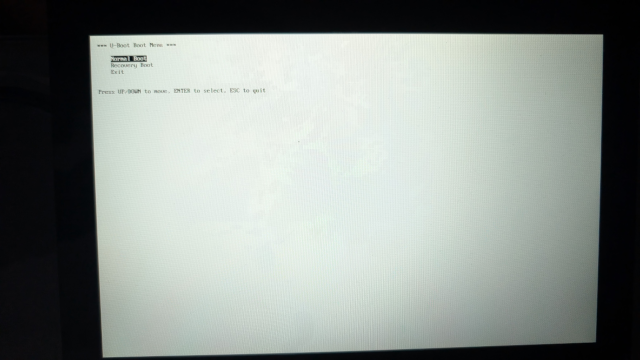

# Having a Bootmenu on the Verdin AM62P with an LVDS display connected

Ensure you have the 10'' 1280x800 LVDS display from Toradex connected to the Mallow Carrier Board. Only LVDS is currently supported for the AM62P in U-Boot.



## Set environment to show bootmenu

In this example we will show the bootmenu on the LVDS display when the board would normally boot. We switch the stdout and stdin to the display and a button keyboard, and then show a bootmenu with two options: Normal Boot and Recovery Boot. Both options will run the same command in this example, which is to disable the screen and then scan for boot devices.

```
setenv bootcmd_normal 'gpio set gpio@600000_71; bootflow scan -b'
setenv bootcmd 'setenv stdout vidconsole; setenv stdin button-kbd; setenv bootmenu_0 Normal Boot=run bootcmd_normal; setenv bootmenu_1 Recovery Boot=run bootcmd_normal; bootmenu -1'
saveenv
boot
```

## Update U-Boot with a new version

To update to a newer version we can use tftp:
```
dhcp; tftp $loadaddr verdin-am62p/u-boot.img; run update_uboot
```
